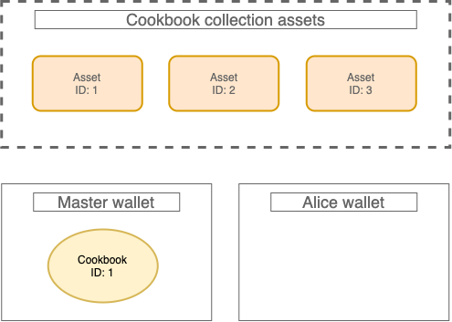
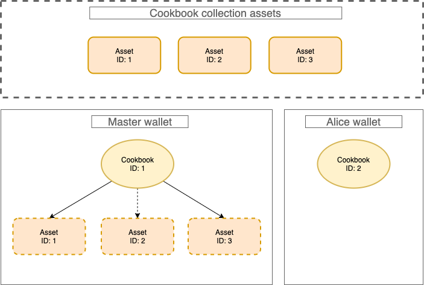
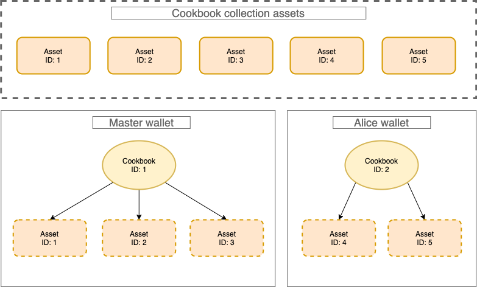
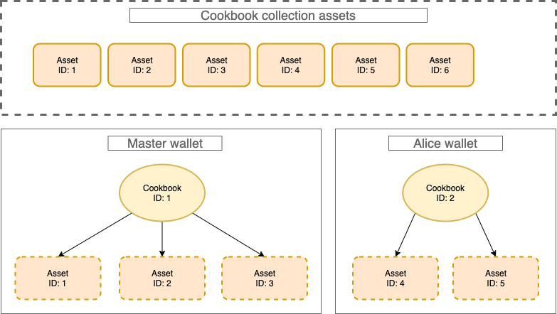
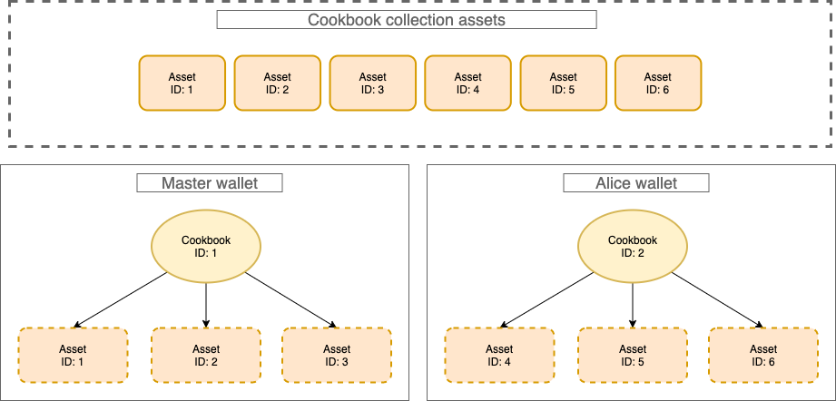
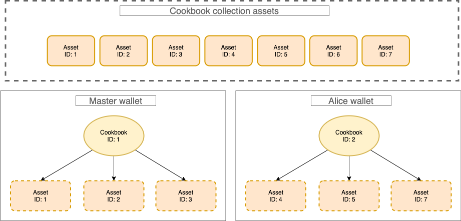
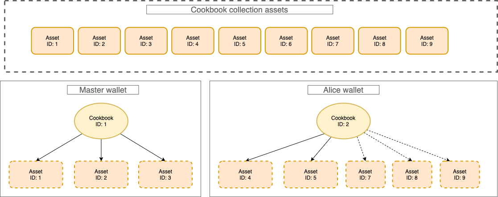
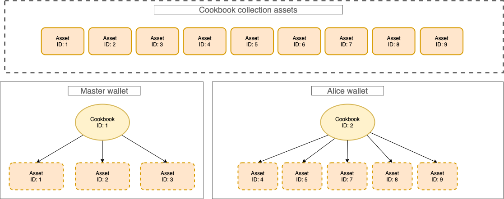
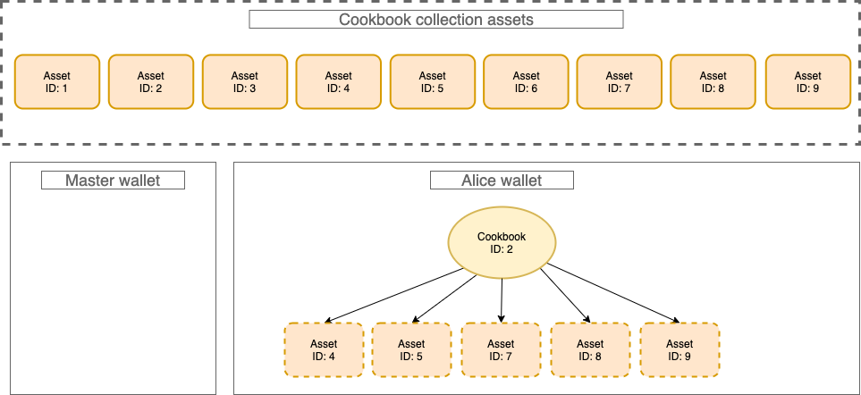

# EVM Multi-Asset Demo

### A contextualized user journey to explore and understand the Multi-Asset NFT features

Multi-Asset (MA) is a Solidity smart contract implementation by [RMRK Team](https://github.com/rmrk-team) that allows to bind assets (PDF, MP3, video files etc...) to an NFT. In this journey we will explore the main features of [RMRK MultiAsset](https://github.com/rmrk-team/evm/blob/dev/contracts/implementations/RMRKMultiAssetImpl.sol).

##### The use cases that will be explored are:

- Creation of an NFT collection that supports asset binding
- Creation of assets to addition to the NFTs of the collection
- Asset replacement
- NFT burning (with relative bound assets)

## User journey context

To better understand the different use cases of this standard we will transform them in situation where dynamics are clear because we are already familiar with them, but every action will be performed with smart contract functions with the help of some Typescript code :muscle:

_We have 2 expert cooks, **Master** and his student **Alice**, that are travelling the world with the aim of create new innovative recipes. Both want to create a cookbook with the best exclusive contents and be remembered as great cooks in the kitchen history._

## Cookbook crafting - Creation of an NFT collection with Multi-Asset support

After starting their travels, Master and Alice decided to separate and they had taken two separate different paths. Master **crafted** his cookbook in Japan, ancient place rich with tradition and history.

```typescript
// Mint cookbook (token)
    await cookBookInstance.mint(
        MASTER.address,         // address that will receive the token
        1,                      // amount of tokens to mint
        { value: pricePerMint } // price per token
    );
```


## Recipes creation - Creation of assets to add to the collection tokens

During his stay Master studied a lot and after getting the inspiration he **gave life** to 3 raw recipes.

```typescript
const INITIAL_RECIPES = 3;

    console.log("Creating recipes for Master's book");
    let allAddingTxs = [];
    for (let i = 0; i < INITIAL_RECIPES; i++) {
        allAddingTxs.push(
            await cookBookInstance.addAssetEntry(   // adds a new asset to the collection (not bound to any token)
                `ipsf://metadata/master_recipe_${i + actual_recipe_id}`,  // metadata URI of the asset
            ),
        );
    }
    await Promise.all(allAddingTxs.map((addingTx) => addingTx.wait()));
```



The recipes were not good enough, so, after a period of perfecting and adjusting, Master **added** them to his cookbook.

```typescript
console.log("Adding recipes to Master's book");
    for (let i = 0; i < INITIAL_RECIPES; i++) {
        const recipe_ID = actual_recipe_id;
        actual_recipe_id++;     // Update to the next ID
        await cookBookInstance.addAssetToToken(
            MASTER_BOOK_ID,     // ID of the token that will receive the asset
            recipe_ID,          // ID of the asset to add
            0                   // ID of the asset to replace with the new one, 0 means none
        );                      // direct addition since the adder is the owner
    }
```

Alice also wanted to craft her cookbook, but creating recognisable recipes is not allowed to everyone, is something exclusive. So she asked Master to give her the permission to contribute to this huge project and... he said **YES** :boom:
Adding Alice as a new contributor for the collection, so she can now insert her existing recipes to the cookbook.

```typescript
console.log("Adding Alice as a new collection contributor.");
    await cookBookInstance.connect(MASTER).addContributor(ALICE.address);

```

After getting the permission Alice crafted her book, but she did it in Argentina.

```typescript
// Alice mints her cookbook
    await cookBookInstance.connect(ALICE).mint(
        ALICE.address,          // address that will receive the token
        1,                      // amount of tokens to mint
        { value: pricePerMint } // price per token
    );
```



She was inspired by different tastes and she created 2 recipes adding them **directly** to her cookbook.

```typescript
const INITIAL_ALICE_RECIPES = 2;
    for (let i = 0; i < INITIAL_ALICE_RECIPES; i++) {
        const recipe_ID = actual_recipe_id;
        actual_recipe_id++;    // Update to the next ID
        await cookBookInstance
            .connect(ALICE)
            .addAssetEntry(     // adds a new asset to the collection (not bound to any token)
                `ipsf://metadata/master_recipe_${recipe_ID}`  // metadata URI of the asset
            );
        await cookBookInstance.
            connect(ALICE).
            addAssetToToken(
                ALICE_BOOK_ID,  // ID of the token that will receive the asset
                recipe_ID,      // ID of the asset to add
                0               // ID of the asset to replace with the new one, 0 means none
            );
    }
```



## Recipe improvement - Asset replacement

During his travel, Master created a recipe dedicated to his student and he decided to **send** it to Alice, to add it to her cookbook.

```typescript
// Master creates a new recipe and Alice adds it to her cookbook
    await cookBookInstance
        .connect(MASTER)
        .addAssetEntry(     // adds a new asset to the collection (not bound to any token)
            `ipsf://metadata/master_recipe_${actual_recipe_id}`   // metadata URI of the asset
        );
```



Alice **accepted** the recipe gifted from her master...

```typescript
await cookBookInstance.connect(ALICE).
        addAssetToToken(
            ALICE_BOOK_ID,      // ID of the token that will receive the asset
            actual_recipe_id,  // ID of the asset to add
            0                   // ID of the asset to replace with the new one, 0 means none
        );
    actual_recipe_id++;    // Update to the next ID
```



...but she discovered that the recipe was missing something. :confused:
After a long search and many attempts she found the right missing ingredient.
So Alice fixed the recipe and she replaced the old one with this new, improved one. :pencil:

```typescript
// Alice creates a recipe and replaces the latest added with it
    await cookBookInstance
        .connect(ALICE)
        .addAssetEntry(     // adds a new asset to the collection (not bound to any token)
            `ipsf://metadata/alice_recipe_${actual_recipe_id}`    // metadata URI of the asset
        );
    const WRONG_RECIPE_ID = actual_recipe_id - 1;
    const FIXED_RECIPE_ID = actual_recipe_id;
    console.log("Replace %d with %d", WRONG_RECIPE_ID, FIXED_RECIPE_ID);
    await cookBookInstance
        .connect(ALICE)
        .addAssetToToken(
            ALICE_BOOK_ID,      // ID of the token that will receive the asset
            FIXED_RECIPE_ID,    // ID of the asset to add
            WRONG_RECIPE_ID     // ID of the asset to replace with the new one
        );
    actual_recipe_id++;    // Update to the next ID
```



After this fix, Alice's career took flight and Master, proud of his student, proposed to create 2 recipes as a collaboration to add her cookbook. 

```typescript
// Master creates 2 recipes and add them to Alice cookbook
    for (let i = 0; i < 2; i++) {
        await cookBookInstance
            .connect(MASTER)
            .addAssetEntry(     // adds a new asset to the collection (not bound to any token)
                `ipsf://metadata/master_recipe_${actual_recipe_id}`   // metadata URI of the asset
            );
        await cookBookInstance.addAssetToToken(
            ALICE_BOOK_ID,      // ID of the token that will receive the asset
            actual_recipe_id,  // ID of the asset to add
            0                   // ID of the asset to replace with the new one, 0 means none
        );
        actual_recipe_id++;
    }
```



After a small review Alice added them to her book. :book:

```typescript
// Alice accepts recipes
    for (let i = 0; i < 2; i++) {
        const CURRENT_recipe_ID = actual_recipe_id - 2 + i;
        let acceptTx = await cookBookInstance
            .connect(ALICE)
            .acceptAsset(           // accept pending asset
                ALICE_BOOK_ID,      // ID of the token that will receive the asset
                0,                  // Index of the asset in the pending array
                CURRENT_recipe_ID  // ID of the asset to add
            );
        acceptTx.wait();
    }
```



## Master retires and burns his cookbook - Token burning with related assets

When the collaboration ended, Master decided to retire. He was an old man and he was also tired of travelling the world. This final decision resulted in him burning his cookbook. :fire:
His only wish was to leave a nice memory and a veil of mystery of his cooking prowess :wave:

Fortunately Master's recipes will be available for the next generations, but without the permission of Alice, his loyal student, none will be able to add the recipes into future cookbooks.

```Typescript
await cookBookInstance.connect(MASTER).
        burn(MASTER_BOOK_ID // ID of the token to burn
        );
```



## User journey summary 

In this tutorial we have seen how to interact with the Multi-Asset implementation in order to:

1. :point_right: **Create a collection** with tokens that support this standard
2. :point_right: **Create and add assets** (resources) to a token
3. :point_right: **Replace** an active asset with another one
4. :point_right: **Burn** a token with all its assets bound

## Development notes :warning:

- When you add a new entry to the collection you are creating a new asset (resource) that can be used by adding it to the collection tokens, but this asset is not *unique* so it can be added to multiple different tokens.
- In this implementation, the assets cannot be unbound from a token. Once you add the asset with ID 5 to the token with ID 1 there is no way to remove it, so be careful when accepting new assets from unknown origins.
On the other hand, an asset can be "*deleted*" by replacing it with a new one, this will keep the number of active assets the same.

## Bugs, doubts and help :pray:

For clarifications, bug reporting or help please open a Github issue or write a message here:
- **Telegram**: https://t.me/rmrkimpl